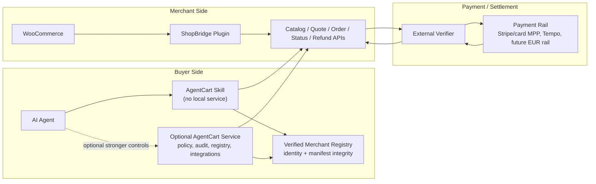

# AgentCart Product Build Plan

> Status: post-hackathon execution plan. This document turns the winning demo
> into a merchant- and buyer-usable product.

## Product Direction

AgentCart should support two buyer integration paths:

1. **Skill-only buyer path**: the buyer installs an agent skill. For a known
   shop it can use a direct ShopBridge URL; for multi-merchant shopping it
   should first resolve a verified registry record, then call merchant
   discovery, quote, approval-summary, order, and status endpoints. This is the
   lowest-friction customer path.
2. **AgentCart service path**: the buyer runs the AgentCart service when they
   need durable household policy, multi-agent approval, stronger audit, delivery
   calendar/task sync, quote tournaments across many merchants, or local
   integrations.

ShopBridge remains the merchant-side WooCommerce plugin. The payment verifier
remains the settlement authority.

## Visual Architecture

## Execution Order

### 1. Skill-Only Buyer Alpha

Goal: a buyer can use AgentCart with only an agent skill and either a
user-specified merchant URL or a verified merchant registry record.

Deliverables:

- productize `gateway/shopbridge-direct-skill` as the lightweight buyer path;
- support manifest, catalog, quote, approval summary, order status, and checkout
  with a supplied payment receipt;
- treat `SHOPBRIDGE_BASE_URL` as a single-merchant override, not a discovery
  system;
- keep Tempo demo proof as an optional sandbox helper, not the default checkout
  model;
- add compact TOON output for agent context and JSON for payment/order calls;
- document safety limits: chat-local approval is not durable household policy.

Definition of done:

- a local agent can quote and order from a ShopBridge merchant without running
  the AgentCart service;
- checkout refuses to run without explicit approval and either a supplied
  payment receipt or configured demo proof helper;
- smoke tests cover catalog, quote, approval summary, and checkout payload
  construction.

Current alpha status: the direct ShopBridge skill can resolve verified registry
records, compare private quotes across multiple verified merchants, return the
winning full quote with an approval packet, produce an approval-bound payment
handoff for an external wallet/payment-capable agent, and reject failed
registry/domain proofs before making catalog or quote calls. It can also ingest
the ShopBridge registry onboarding bundle as a registry source for local
single-merchant tests. Production still needs durable buyer policy, persistent
audit, richer matching for multi-item grocery baskets, and a packaged setup
flow for non-technical buyers.

### 2. Merchant Alpha

Goal: a real WooCommerce merchant can expose trustworthy final quotes.

Deliverables:

- replace demo quote math with WooCommerce cart, tax, and shipping calculation;
- require a real fulfillment address for quotes;
- expose delivery methods/windows from WooCommerce or plugin settings;
- add readiness gates for HTTPS, support email, terms/refund URL, stable
  merchant id, tax/shipping setup, verifier configuration, and demo-mode status;
- support low-friction merchant-controlled product exposure modes;
- enforce per-product quantity limits, checkout exclusion overrides, category
  blocklists, product shipping-country overrides, soft quote stock holds, and
  structured restricted-goods metadata;
- expose perishable, deposit-bearing, final-sale, and substitution-sensitive
  handling metadata from normal WooCommerce tags, attributes, categories, and
  optional product-level AgentCart override switches;
- expose store-level returns, substitution, and cancellation-request defaults
  from the merchant settings page and bind them into approved quotes.

Definition of done:

- quote totals match WooCommerce checkout totals for the same basket/address;
- unsupported products, destinations, and quantities fail before payment;
- merchant admin can understand why the shop is or is not agent-ready.

Current alpha status: ShopBridge quotes through WooCommerce cart, tax, shipping,
stock, and order APIs; exposes merchant-controlled product exposure modes;
publishes automatic and explicit item-level aftercare policy metadata; and
renders a guided setup checklist in `WooCommerce -> AgentCart` for identity,
agent-safe products, tax/shipping, payment verifier, registry proof, and sandbox
testing. The plugin publishes a registry onboarding bundle with the suggested
record, proof, revocation document, and one-entry feed so registries can ingest
the shop without merchant-side hash copy/paste. The same setup guide is
included in the public capability document for remote onboarding tools. The repo
also includes an opt-in live smoke script for checking manifest/capability setup
state, catalog exposure, and WooCommerce quote totals against a seeded or
staging shop, plus a one-command WooCommerce demo smoke wrapper that starts,
seeds, and verifies the bundled local shop. Production still needs a polished
setup wizard, WP/Woo integration tests, and stronger hosted registry/payment-
provider onboarding.

### 3. Idempotent Order And Replay Safety

Goal: ShopBridge can safely accept public agent checkout requests.

Deliverables:

- require idempotency keys for public order and refund calls;
- consume stored quotes atomically;
- store and reject reused payment and refund references;
- rate-limit catalog, quote, order, and verifier-triggering endpoints;
- make refund overages reject instead of silently clamp.

Definition of done:

- concurrent checkout requests cannot create duplicate paid orders;
- replayed payment references fail closed;
- verifier cost and public endpoint abuse have basic protection.

Current alpha status: the WooCommerce plugin requires order/refund idempotency
keys, locks checkout by idempotency key and merchant quote id, deletes consumed
quote transients after paid order creation, rejects reused payment/refund
references, rate-limits REST endpoints, and rejects refund overages. Production
still needs a WordPress/WooCommerce integration harness and host-level abuse
controls.

### 4. Real Settlement Path

Goal: one production-like payment rail can create and refund paid WooCommerce
orders.

Deliverables:

- choose Stripe/card MPP or Stripe-backed card settlement as the first merchant
  rail;
- bind amount, currency, merchant id/profile, quote hash, idempotency key, and
  transaction reference;
- execute refunds through the original rail;
- keep Tempo stablecoin support as a separate rail with explicit FX/settlement
  semantics.

Definition of done:

- a WooCommerce order is marked paid only after verifier success;
- a refund is recorded only after rail refund success;
- demo/test rails cannot be mistaken for production EUR settlement.

### 5. Grocery MVP

Goal: agents can do useful grocery and household replenishment, not only single
demo products.

Deliverables:

- multi-item baskets;
- pantry/favorites;
- unit price and package size comparison;
- substitutions and dietary/restricted-item policy;
- delivery slot awareness;
- recurring replenishment rules;
- aftercare commands: order status, tracking, cancellation, refund request,
  merchant support, and proof export.

Definition of done:

- an agent can replenish a small basket with approval and explain tradeoffs;
- users can inspect, cancel, refund, or contact the merchant after checkout.

Current alpha status: the direct ShopBridge skill can summarize order status,
fulfillment/tracking, refundability, merchant support, payment proof, and a
refund request draft without calling merchant-token refund, cancellation, or
order mutation endpoints. It also surfaces item-level policy review for
perishable, deposit-bearing, final-sale, substitution-sensitive, or restricted
products, plus store-level cancellation and substitution policy defaults from
the approved quote/order. The WooCommerce plugin now has a merchant-token
protected, idempotent cancellation endpoint that cancels eligible AgentCart
orders before fulfillment locks, reports when a separate rail refund is still
required, exposes an `aftercare_state` contract across order/status/refund and
cancellation responses, and normalizes tracking from common Woo shipment plugin
metadata into a stable adapter contract. Production still needs richer refund
workflows, carrier API polling/webhooks, and durable household aftercare state
in the AgentCart service path.

Current grocery alpha status: ShopBridge exposes structured package-size
metadata from WooCommerce product weights, structured tag/dietary/allergen
metadata from normal WooCommerce product tags and attributes, and optional
product-level aftercare overrides for perishables, deposits, final-sale goods,
and substitution-sensitive items. The direct buyer skill can rank verified
merchant quotes by package/unit value, compare verified merchants by
whole-basket quotes, and handle explicit user-provided substitutions with
inherited exclusion/tag/allergen constraints. Production still needs stronger
cross-merchant basket splitting, richer dietary constraints, and pantry-aware
replenishment.

### 6. Production Packaging

Goal: the product is installable and maintainable.

Deliverables:

- buyer setup wizard or one-command package for Skill-only and service modes;
- WordPress plugin `readme.txt`, changelog, PHPCS, PHPUnit/WP integration tests,
  uninstall policy, release ZIP, and update path;
- signed merchant manifests and an identity/integrity registry;
- tamper-evident audit export and dispute packet generation.

Definition of done:

- a merchant and a buyer can install without reading the hackathon internals;
- releases have tests, versioning, and rollback/update guidance.

Current alpha status: the repo packages the WooCommerce plugin ZIP and the
skill-only buyer ZIP under `dist/`, includes WordPress release metadata
(`readme.txt`) and conservative uninstall cleanup, verifies both artifacts in
the main pipeline, generates `dist/agentcart-release.json` with component
versions and artifact checksums, and documents skill-only plus home-server buyer
setup and upgrade/rollback in `docs/BUYER_SETUP.md` and `docs/RELEASES.md`. A
release verifier checks manifest schema, component versions, artifact sizes,
SHA-256s, optional trusted manifest/source pins, and optional detached HMAC
release signatures for private/self-hosted release channels. Production still
needs PHPCS/WP integration tests, public asymmetric release signing or a managed
update channel, plus a non-technical setup wizard.

### 7. Registry Alpha

Goal: agents can discover multiple opt-in merchants without trusting arbitrary
URLs or merchant-provided prompt text.

Deliverables:

- define a canonical registry record containing merchant id, domain, manifest
  URL/hash, payment recipient/network, supported countries, updated timestamp,
  revocation pointer, and signature or onchain proof;
- fetch the manifest from the registered merchant domain and verify the
  canonical hash before catalog or quote calls;
- fail closed on domain mismatch, claim/manifest hash mismatch, revoked records,
  invalid/missing advertised revocation document, invalid signature/proof, or
  payment-recipient mismatch;
- keep product catalog, prices, stock, buyer intent, address, and quotes
  off-chain and out of the public registry;
- mark merchant/product text as untrusted data so it can be summarized or
  displayed but never followed as instructions.

Definition of done:

- quote tournaments only include verified merchants unless the user explicitly
  supplies a local override;
- tests cover valid record, hash mismatch, domain mismatch, revoked record and
  matching revocation document, payment-recipient mismatch, and hostile product
  text.

## Architecture Deepening

The code should move toward these deeper modules:

1. **Purchase Lifecycle Module**
   - Files today: `gateway/agentcart.py`
   - Owns: quote, policy, approval, checkout, order, refund.
   - Benefit: purchase invariants become local and testable.

2. **State And Audit Module**
   - Files today: `gateway/agentcart.py`, JSON state/audit files.
   - Owns: quotes, approvals, challenges, idempotency, replay references,
     orders, audit events.
   - Benefit: JSON, SQLite, and Postgres adapters can satisfy the same seam.

3. **Merchant Adapter Contract**
   - Files today: `WooCommerceAdapter`, ShopBridge plugin endpoints.
   - Owns: manifest, catalog, quote, order, status, refund shapes.
   - Benefit: shared fixtures and contract tests protect every merchant adapter.

4. **Payment Verifier Module**
   - Files today: `gateway/scripts/stripe-mpp-verifier.mjs`,
     `docs/VERIFIER_CONTRACT.md`, `docs/fixtures/verifier/`, ShopBridge
     verifier calls.
   - Owns: payment/refund verification, replay checks, rail-specific binding,
     provider error classification.
   - Benefit: settlement concerns stop leaking into catalog and order code.

5. **Buyer Integration Module**
   - Files today: `gateway/shopbridge-direct-skill`,
     `gateway/openclaw-skill`, `household-os`.
   - Owns: Skill-only commands, optional service client, approval UX,
     aftercare commands.
   - Benefit: agents get a small stable interface whether the buyer runs a
     local service or not.

## Near-Term Rule

Do not add new grocery features directly into the large demo files unless the
change is already behind one of the deeper module seams above. The first
production work should make the seams deeper, then add features through them.
