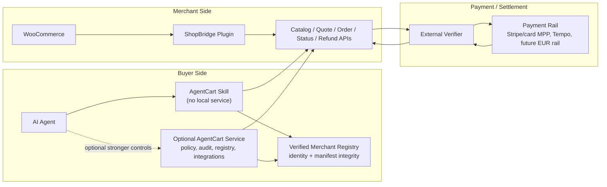

# AgentCart Product Build Plan

> Status: post-hackathon execution plan. This document turns the winning demo
> into a merchant- and buyer-usable product.

## Product Direction

AgentCart should support two buyer integration paths:

1. **Skill-only buyer path**: the buyer installs an agent skill. For a known
   shop it can use a direct ShopBridge URL; for multi-merchant shopping it
   should first resolve a verified registry record, then call merchant
   discovery, quote, approval-summary, order, and status endpoints. This is the
   lowest-friction customer path.
2. **AgentCart service path**: the buyer runs the AgentCart service when they
   need durable household policy, multi-agent approval, stronger audit, delivery
   calendar/task sync, quote tournaments across many merchants, or local
   integrations.

ShopBridge remains the merchant-side WooCommerce plugin. The payment verifier
remains the settlement authority.

## Visual Architecture

## Execution Order

### 1. Skill-Only Buyer Alpha

Goal: a buyer can use AgentCart with only an agent skill and either a
user-specified merchant URL or a verified merchant registry record.

Deliverables:

- productize `gateway/shopbridge-direct-skill` as the lightweight buyer path;
- support manifest, catalog, quote, approval summary, order status, and checkout
  with a supplied payment receipt;
- treat `SHOPBRIDGE_BASE_URL` as a single-merchant override, not a discovery
  system;
- keep Tempo demo proof as an optional sandbox helper, not the default checkout
  model;
- add compact TOON output for agent context and JSON for payment/order calls;
- document safety limits: chat-local approval is not durable household policy.

Definition of done:

- a local agent can quote and order from a ShopBridge merchant without running
  the AgentCart service;
- checkout refuses to run without explicit approval and either a supplied
  payment receipt or configured demo proof helper;
- smoke tests cover catalog, quote, approval summary, and checkout payload
  construction.

### 2. Merchant Alpha

Goal: a real WooCommerce merchant can expose trustworthy final quotes.

Deliverables:

- replace demo quote math with WooCommerce cart, tax, and shipping calculation;
- require a real fulfillment address for quotes;
- expose delivery methods/windows from WooCommerce or plugin settings;
- add readiness gates for HTTPS, support email, terms/refund URL, stable
  merchant id, tax/shipping setup, verifier configuration, and demo-mode status;
- add product controls for quantity limits, restricted categories, perishables,
  deposits, shipping country overrides, substitutions, and allergens.

Definition of done:

- quote totals match WooCommerce checkout totals for the same basket/address;
- unsupported products, destinations, and quantities fail before payment;
- merchant admin can understand why the shop is or is not agent-ready.

### 3. Idempotent Order And Replay Safety

Goal: ShopBridge can safely accept public agent checkout requests.

Deliverables:

- require idempotency keys for public order and refund calls;
- consume stored quotes atomically;
- store and reject reused payment and refund references;
- rate-limit catalog, quote, order, and verifier-triggering endpoints;
- make refund overages reject instead of silently clamp.

Definition of done:

- concurrent checkout requests cannot create duplicate paid orders;
- replayed payment references fail closed;
- verifier cost and public endpoint abuse have basic protection.

### 4. Real Settlement Path

Goal: one production-like payment rail can create and refund paid WooCommerce
orders.

Deliverables:

- choose Stripe/card MPP or Stripe-backed card settlement as the first merchant
  rail;
- bind amount, currency, merchant id/profile, quote hash, idempotency key, and
  transaction reference;
- execute refunds through the original rail;
- keep Tempo stablecoin support as a separate rail with explicit FX/settlement
  semantics.

Definition of done:

- a WooCommerce order is marked paid only after verifier success;
- a refund is recorded only after rail refund success;
- demo/test rails cannot be mistaken for production EUR settlement.

### 5. Grocery MVP

Goal: agents can do useful grocery and household replenishment, not only single
demo products.

Deliverables:

- multi-item baskets;
- pantry/favorites;
- unit price and package size comparison;
- substitutions and dietary/restricted-item policy;
- delivery slot awareness;
- recurring replenishment rules;
- aftercare commands: order status, tracking, cancellation, refund request,
  merchant support, and proof export.

Definition of done:

- an agent can replenish a small basket with approval and explain tradeoffs;
- users can inspect, cancel, refund, or contact the merchant after checkout.

### 6. Production Packaging

Goal: the product is installable and maintainable.

Deliverables:

- buyer setup wizard or one-command package for Skill-only and service modes;
- WordPress plugin `readme.txt`, changelog, PHPCS, PHPUnit/WP integration tests,
  uninstall policy, release ZIP, and update path;
- signed merchant manifests and an identity/integrity registry;
- tamper-evident audit export and dispute packet generation.

Definition of done:

- a merchant and a buyer can install without reading the hackathon internals;
- releases have tests, versioning, and rollback/update guidance.

### 7. Registry Alpha

Goal: agents can discover multiple opt-in merchants without trusting arbitrary
URLs or merchant-provided prompt text.

Deliverables:

- define a canonical registry record containing merchant id, domain, manifest
  URL/hash, payment recipient/network, supported countries, updated timestamp,
  revocation pointer, and signature or onchain proof;
- fetch the manifest from the registered merchant domain and verify the
  canonical hash before catalog or quote calls;
- fail closed on domain mismatch, claim/manifest hash mismatch, revoked records,
  invalid signature/proof, or payment-recipient mismatch;
- keep product catalog, prices, stock, buyer intent, address, and quotes
  off-chain and out of the public registry;
- mark merchant/product text as untrusted data so it can be summarized or
  displayed but never followed as instructions.

Definition of done:

- quote tournaments only include verified merchants unless the user explicitly
  supplies a local override;
- tests cover valid record, hash mismatch, domain mismatch, revoked record,
  payment-recipient mismatch, and hostile product text.

## Architecture Deepening

The code should move toward these deeper modules:

1. **Purchase Lifecycle Module**
   - Files today: `gateway/agentcart.py`
   - Owns: quote, policy, approval, checkout, order, refund.
   - Benefit: purchase invariants become local and testable.

2. **State And Audit Module**
   - Files today: `gateway/agentcart.py`, JSON state/audit files.
   - Owns: quotes, approvals, challenges, idempotency, replay references,
     orders, audit events.
   - Benefit: JSON, SQLite, and Postgres adapters can satisfy the same seam.

3. **Merchant Adapter Contract**
   - Files today: `WooCommerceAdapter`, ShopBridge plugin endpoints.
   - Owns: manifest, catalog, quote, order, status, refund shapes.
   - Benefit: shared fixtures and contract tests protect every merchant adapter.

4. **Payment Verifier Module**
   - Files today: `gateway/scripts/stripe-mpp-verifier.mjs`,
     `docs/VERIFIER_CONTRACT.md`, ShopBridge verifier calls.
   - Owns: payment/refund verification, replay checks, rail-specific binding.
   - Benefit: settlement concerns stop leaking into catalog and order code.

5. **Buyer Integration Module**
   - Files today: `gateway/shopbridge-direct-skill`,
     `gateway/openclaw-skill`, `household-os`.
   - Owns: Skill-only commands, optional service client, approval UX,
     aftercare commands.
   - Benefit: agents get a small stable interface whether the buyer runs a
     local service or not.

## Near-Term Rule

Do not add new grocery features directly into the large demo files unless the
change is already behind one of the deeper module seams above. The first
production work should make the seams deeper, then add features through them.
