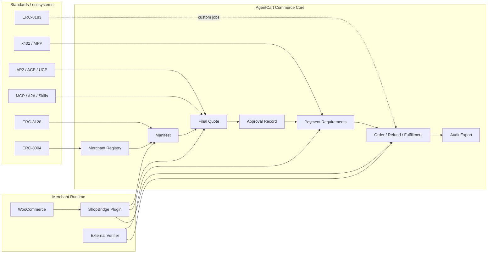

# AgentCart Standards Alignment

> Status: product direction and implementation roadmap. These standards are
> moving quickly, so AgentCart should keep a stable commerce core and add
> adapters at explicit seams instead of hard-coding one protocol into the whole
> product.

## Direction

AgentCart ShopBridge should be the WooCommerce retail bridge for agentic
commerce:

- verified merchant discovery;
- final quote binding for products, VAT, stock, shipping, delivery, and
  merchant of record;
- explicit buyer approval;
- payment-proof handoff;
- WooCommerce order, status, cancellation, refund, and fulfillment state;
- portable audit records.

The standards strategy is compatibility, not a pivot. AgentCart keeps its core
commerce model stable and maps standards into it:

```text
standards/adapters -> AgentCart commerce core -> WooCommerce + verifier rails
```

## Architecture Principles

1. **Commerce core first**: Merchant, Manifest, Catalog, Quote, Approval,
   Payment Requirements, Order, Refund, Fulfillment, Registry Record, and Audit
   Packet remain AgentCart concepts.
2. **Adapters at the edges**: x402, MPP, AP2, ACP, UCP, MCP, A2A, ERC-8004,
   ERC-8128, and ERC-8183 should translate into or out of the same commerce
   core.
3. **Registry is identity, not marketplace ranking**: public records can prove
   who a merchant is, where its manifest lives, and which payment destination is
   bound. Product search, final quotes, and ranking stay private to the buyer
   side.
4. **Household agents stay private by default**: ERC-8004-style public identity
   makes most sense for merchants, registry operators, validators, and hosted
   service providers. A household agent should not need to publish shopping
   preferences or home context.
5. **Payment is not checkout**: x402/MPP can prove a payment or authorization,
   but ShopBridge still needs quote totals, tax, shipping, stock, refunds,
   order status, and audit.

## Standards Map

| Standard or ecosystem | AgentCart fit | Current status | Target |
| --- | --- | --- | --- |
| x402 / HTTP 402 | Payment requirement, authorization retry, and payment response shape | MPP-shaped HTTP 402 flow exists, but not x402 V2 headers | Add x402-compatible challenge/proof adapter while keeping verifier contract rail-neutral |
| MPP | Machine payment proof rail | Tempo demo proof and MPP-shaped flow exist | Keep as one payment protocol under `payment_requirements.protocols[]` |
| Stripe machine payments / stablecoin acceptance | Production-friendly merchant settlement path for eligible merchants | Verifier fixtures and sandbox helper exist; US-region limitation documented | Treat as one rail behind the verifier seam, not as the whole checkout model |
| ERC-8004 | Public identity, registration file, reputation, and validation for agents/service providers | Off-chain merchant registry with domain proof, revocation, hash binding | Add an ERC-8004 mapping/export for merchant/ShopBridge service records |
| ERC-8128 | Wallet-signed HTTP requests for sensitive agent API calls | Not implemented | Add optional signed-request verification for quote, checkout, status, cancellation, and refund calls |
| ERC-8183 | Escrowed jobs with evaluator attestation | Not implemented | Use later for custom orders, services, pre-orders, disputes, and escrow flows; not required for normal grocery checkout |
| AP2 / ACP / UCP | Agentic commerce/cart/authorization protocols | Not implemented as protocol adapters | Build translators into AgentCart Quote, Approval, Payment Requirements, and Order models |
| MCP / A2A / agent skills | How agents discover and call capabilities | Direct skill exists; service exposes OpenAPI/llms/capability docs | Keep skill-first buyer path and add MCP/A2A wrappers only when they improve distribution |

## Canonical Core Model

These fields should remain the stable shape that every adapter maps to:

| AgentCart concept | Required binding |
| --- | --- |
| Merchant | stable merchant id, domain, manifest URL, support contacts, shipping countries, payment destinations |
| Registry Record | merchant id, domain, manifest URL, registry claim hash, payment binding, update timestamp, revocation pointer, proof type |
| Manifest | API endpoints, protocol profiles, registry claim, payment requirements, setup/readiness state |
| Quote | items, quantities, tax, shipping, discounts, delivery window, total, currency, merchant of record, quote hash, expiry |
| Approval | exact quote hash, human-readable consent request, approver, decision timestamp, approval record hash |
| Payment Requirements | supported protocols, rail id, amount/currency, destination, verifier expectations, expiry |
| Order | merchant order id, payment verification, fulfillment/status, refund/cancellation state |
| Audit Packet | quote, approval, payment, checkout, order, refund, and import/export hashes |

## Visual Roadmap



## Execution Roadmap

### Slice 1: Registry Transparency And Refresh UX

Status: alpha implemented.

Goal: merchants and buyer agents can see whether a ShopBridge record is current,
verified, stale, or revoked without manual hash handling.

Deliverables:

- merchant admin status panel for registry claim hash, record hash, proof URL,
  revocation URL, `updated_at`, and last public verification result;
- one-click refresh/rebuild of registry claim and proof metadata;
- local verifier action that checks the public manifest, proof, revocation
  document, payment binding, endpoint domain scope, and stale timestamp;
- gateway registry page that distinguishes eligible, stale, revoked, and failed
  records with machine-readable reasons;
- docs that describe how this later maps to ERC-8004 registration files.

Definition of done:

- a merchant does not copy hashes manually;
- a buyer agent can explain why a merchant was included or excluded;
- the same verified record shape can still be sourced from off-chain JSON,
  merchant bundle URL, append-only feed, or future onchain registry.

### Slice 2: Manifest Protocol Profiles

Status: alpha implemented.

Goal: every merchant manifest declares which commerce and payment profiles it
supports in a stable, adapter-friendly way.

Deliverables:

- `protocol_profiles[]` and `protocol_profile_ids[]` sections in
  `/.well-known/agentcart.json` and the capability document;
- explicit entries for `agentcart-shopbridge`, `mpp-http-auth`,
  `stripe-card-mpp`, `erc8004-ready`, and `x402-compatible` only when actually
  configured;
- no `signed-http-ready` profile until that adapter is implemented;
- registry records bind compact `protocol_profile_ids` while preserving legacy
  `supported_protocols`;
- gateway, registry tools, smoke tests, and the direct skill read profile-aware
  manifests with legacy `protocols[]` fallback;
- tests that unavailable rails are not advertised.

Definition of done:

- an agent can choose the right adapter before making quote or checkout calls;
- docs no longer rely on ambiguous "MPP-shaped" wording without structured
  machine-readable fields.

### Slice 3: x402 Compatibility Shim

Status: alpha implemented.

Goal: keep the current verifier flow, but expose payment requirements in a way
that x402-capable agents can understand.

Deliverables:

- x402-compatible 402 response/header option for quote-bound checkout;
- mapping from AgentCart `payment_requirements.protocols[]` to x402 payment
  requirements;
- configured-only `x402-compatible` manifest profile with explicit network,
  asset, atomic amount, payTo, timeout, and verifier-required metadata;
- direct-skill and gateway readers that preserve quote-level x402 payment
  requirements without deriving payable destinations from merchant-wide
  manifest profiles;
- tests for amount, currency, destination, network, quote hash, expiry, and
  verifier response binding.

Definition of done:

- existing AgentCart clients keep working;
- x402-capable clients can detect and satisfy payment requirements through a
  standard-shaped flow.

### Slice 4: Signed HTTP Requests

Goal: reduce bearer-token dependence for public/sensitive endpoints.

Deliverables:

- optional ERC-8128-style verification for quote, checkout, status,
  cancellation, and refund requests;
- nonce/expiry replay protection;
- merchant settings for accepted signer modes and transition period;
- clear errors when signatures omit method, path, digest, nonce, or expiry.

Definition of done:

- public checkout can require request-bound signatures;
- compromised bearer tokens are no longer the only line of defense.

### Slice 5: Protocol Translators

Goal: support external agentic commerce clients without changing the
WooCommerce plugin core.

Deliverables:

- translator interfaces for AP2/ACP/UCP-style cart, authorization, and order
  concepts;
- MCP/A2A wrappers only when they improve agent distribution;
- conformance fixtures showing the same purchase maps to the same AgentCart
  Quote, Approval, Payment Requirements, and Order.

Definition of done:

- new protocols are additive adapters;
- ShopBridge does not become a separate implementation per standard.

### Slice 6: Escrow And Custom Orders

Goal: handle purchases that are not ordinary retail checkout.

Deliverables:

- ERC-8183-inspired job/escrow mapping for custom services, pre-orders,
  disputed fulfillment, and evaluator-attested completion;
- explicit separation from normal grocery/retail order flow;
- refund/dispute evidence linked into audit exports.

Definition of done:

- normal WooCommerce checkout remains simple;
- escrow flows have their own state machine and audit trail.

## Near-Term Build Order

1. Registry transparency and refresh UX. Alpha implemented.
2. Manifest protocol profiles. Alpha implemented.
3. x402 compatibility shim. Alpha implemented.
4. Signed HTTP request verification. Next.
5. AP2/ACP/UCP/MCP/A2A translators.
6. ERC-8183-style escrow/custom-order flow.

This order keeps the merchant onboarding friction low while making the project
more legible to the broader agentic commerce ecosystem.

## References

- x402 HTTP 402 docs: https://docs.x402.org/core-concepts/http-402
- ERC-8004 Trustless Agents: https://eips.ethereum.org/EIPS/eip-8004
- ERC-8128 Signed HTTP Requests: https://erc8128.org/
- ERC-8183 Agentic Commerce: https://eips.ethereum.org/EIPS/eip-8183
- Stripe x402 machine payments: https://docs.stripe.com/payments/machine/x402
