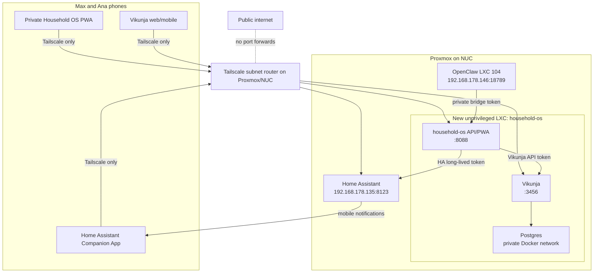

# Household OS Assistant

Status: deployed on `2026-05-31`.

## Live Deployment

- Proxmox CT: `106`
- Hostname: `household-os`
- IP: `192.168.178.150`
- Vikunja: `http://192.168.178.150:3456`
- Household OS PWA/API: `http://192.168.178.150:8088`
- Shared OpenClaw chat PWA: `http://192.168.178.150:8088/chat`
- Runtime path inside the CT: `/opt/household-os`
- Root-only bootstrap credentials: `/root/household-os/bootstrap-credentials.txt`
- Bridge audit log inside the `household-os` container: `/data/audit.jsonl`
- OpenClaw skill path in CT `104`: `/home/openclaw/workspace/skills/household-os-vikunja`
- OpenClaw bridge env in CT `104`: `/etc/openclaw/household-os.env`
- OpenClaw gateway env in CT `106`: `OPENCLAW_GATEWAY_URL` and
  `OPENCLAW_GATEWAY_TOKEN` in `/opt/household-os/.env`

Live Vikunja users:

- `max`
- `ana`
- `household-assistant`

Live Vikunja projects:

- `Today / Recurring`
- `This Week / Active`
- `To Buy`
- `Home Automation`
- `Life Admin`
- `Waiting / Scheduled`
- `Done / Archive`

The original skeleton projects were renamed to these board/list names on
`2026-05-31`.

Imported task set:

- Source: Codex attachment `pasted-text.txt` from `2026-05-31`
- Open tasks: `25`
- Done/archive tasks: `2`
- Daily recurring task: `Lüften!!`
- Biweekly recurring task: `Check HelloFresh code`
- Active week tasks due between `2026-06-02` and `2026-06-07`
- Scheduled item: `Ana femtoLASIK` due `2026-06-08`
- Waiting reminder: `Glasses Ana` reminder on `2026-06-22`

Previous initial project names before import:

- `Daily habits`
- `Shopping`
- `Life admin`
- `Home automation`
- `Recurring reminders`
- `Weekend plan`

Live Home Assistant wiring:

- Long-lived token client name: `Household OS bridge`
- Bridge authorization secret in HA: `household_os_authorization`
- Notifications: `notify.mobile_app_maximilians_iphone`,
  `notify.mobile_app_iphone_paula`
- Shopping todo entity: `todo.einkaufsliste`
- Window entities:
  `binary_sensor.living_room_fenster`,
  `binary_sensor.hallway_fenster`,
  `binary_sensor.bathroom_fenster`,
  `binary_sensor.bedroom_fenster`,
  `binary_sensor.guest_room_fenster`,
  `binary_sensor.office_fenster`
- CO2 entities: none yet; add them to `.env` after the first CO2 sensor is
  onboarded.
- Home Assistant scripts:
  `script.household_task_summary_notify`,
  `script.household_due_task_notify`,
  `script.household_lueften_reminder`,
  `script.household_weekend_reset`
- Bridge allowlisted Home Assistant scripts:
  `script.household_lueften_reminder`,
  `script.household_weekend_reset`
- Automations:
  `automation.household_lueften_manual_daily_reminder` at `18:30` daily,
  `automation.household_morning_task_digest` at `08:15` daily,
  `automation.household_evening_task_digest` at `19:30` daily,
  `automation.household_weekly_task_summary` at `10:00` every Sunday

Validation completed:

- `docker-compose up -d --build` on CT `106`
- Vikunja `/api/v1/info` returns `v2.3.0`
- Household OS `/health` reports Vikunja, Home Assistant, and bridge auth
  configured
- OpenClaw lists `household-os-vikunja` as ready
- OpenClaw helper can list live Vikunja projects
- OpenClaw helper can generate a weekly summary with labels, assignees,
  reminders, and recurrence metadata
- Shared chat PWA can call OpenClaw through the private gateway and stores a
  shared JSONL transcript at `/data/chat.jsonl`
- Bridge created, commented, and completed a smoke-test task in Vikunja
- Bridge read Home Assistant ventilation/window state
- Bridge sent one deployment test notification to both configured mobile apps
- Home Assistant summary script was triggered successfully once after wiring
  `household_os_authorization`
- Non-allowlisted Home Assistant script trigger returned HTTP `403`

This design keeps Vikunja as the household task source of truth, Home Assistant
as the visibility and automation layer, OpenClaw as the reasoning gateway, and
Tailscale as the only remote-access path.

## Recommended Architecture



## Services

Existing services:

- Proxmox NUC.
- Home Assistant at `192.168.178.135:8123`.
- OpenClaw LXC `104` at `192.168.178.146:18789`.
- Tailscale subnet router on the Proxmox/NUC side.

New services:

- A dedicated unprivileged `household-os` LXC.
- Docker Compose inside that LXC.
- `vikunja` container for the web UI and REST API.
- `vikunja-db` Postgres container.
- `household-os` bridge container for the private command PWA, audit log, and
  narrow Vikunja/Home Assistant API wrappers.

Files in this proof of concept:

- `docker-compose.yml`: Vikunja, Postgres, and the bridge.
- `env.example`: all non-committed runtime settings.
- `household_os.py`: stdlib-only HTTP service and PWA.
- `openclaw-skill/SKILL.md`: OpenClaw skill contract.
- `openclaw-skill/scripts/household-os-command.py`: stdin JSON command helper.
- `home-assistant/household_os.package.example.yaml`: optional HA notify group
  and safe script examples.
- `tailscale-policy.example.hujson`: example Max/Ana-only tailnet access.

The live `.env` contains real tokens and is intentionally stored only on CT
`106`.

## Proxmox Placement

Run Vikunja as a Docker container inside a dedicated unprivileged LXC.

Do not run it as a full VM for phase 1. A VM is heavier than needed for a small
task app and Postgres. Do not put Docker directly on the Proxmox host either;
the host should stay infrastructure-only. The LXC gives enough isolation,
simple Proxmox backups, and a clean place to keep Docker Compose state.

Recommended shape:

- CT ID: `106`.
- Hostname: `household-os`.
- Debian 12 or 13.
- 2 vCPU, 2-4 GB RAM, 32 GB disk.
- Unprivileged LXC with `nesting=1,keyctl=1`.
- Static DHCP lease, for example `192.168.178.150`.
- Docker Engine and Docker Compose plugin installed inside the CT.

## Authentication

### Vikunja

Create a dedicated Vikunja user, for example `household-assistant`, and share
only the household projects with that user. Create a scoped API token in
Vikunja under `Settings -> API Tokens`.

The bridge uses:

```http
Authorization: Bearer <VIKUNJA_TOKEN>
```

Store it only in `.env` on the LXC:

```env
VIKUNJA_TOKEN=tk_...
VIKUNJA_API_URL=http://vikunja:3456/api/v1
```

Initial token permissions should cover project reads, task reads/writes, and
task comments. Do not use an admin token.

### Home Assistant

Create a dedicated Home Assistant user, for example `household-os`, then create
a long-lived access token from that user's profile.

Current live deployment note: the bridge uses a dedicated long-lived token named
`Household OS bridge`, generated through the existing local Home Assistant
bootstrap credential. If strict per-user attribution becomes important, create a
separate Home Assistant UI user and rotate `HOMEASSISTANT_TOKEN` in
`/opt/household-os/.env`.

The bridge uses:

```http
Authorization: Bearer <HOMEASSISTANT_TOKEN>
```

Store it only in `.env`:

```env
HOMEASSISTANT_URL=http://192.168.178.135:8123
HOMEASSISTANT_TOKEN=...
```

The bridge only exposes these Home Assistant operations:

- Send notifications to configured `notify.*` services.
- Add an item to one configured `todo.*` list.
- Read configured CO2 and window entities.
- Trigger scripts listed in `HA_ALLOWED_SCRIPT_IDS`.

## Integration Choice

Use direct Vikunja API access for OpenClaw and Household OS.

Do not use CalDAV for the assistant write path. Vikunja documents CalDAV as an
early alpha feature, and its supported VTODO properties do not include comments.
That makes it a poor fit for summaries, stale-task review, and assistant-added
context.

Do not make the Home Assistant Vikunja integration the source of truth. Vikunja
lists it as community-maintained. It can be useful later to display tasks as HA
todo entities, but OpenClaw should still read/write Vikunja through the official
REST API.

Use a custom bridge service, not a broad sync service, for phase 2:

- OpenClaw calls one narrow local API.
- Vikunja remains canonical.
- Home Assistant receives notifications, dashboard cards, and safe script calls.
- The bridge creates a JSONL audit record for every command.

## Minimal OpenClaw/Vikunja Skill

Supported commands:

- `list_projects`
- `list_tasks` by `project_id`, `done`, `due_before`, `due_after`,
  `stale_days`
- `create_task`
- `complete_task`
- `update_due_date`
- `add_comment`
- `update_description`
- `weekly_summary`
- `daily_summary`

OpenClaw should call the bridge command endpoint:

```sh
HOUSEHOLD_OS_URL=http://192.168.178.150:8088
HOUSEHOLD_OS_TOKEN=...
python3 openclaw-skill/scripts/household-os-command.py <<'JSON'
{"command":"weekly_summary","args":{}}
JSON
```

Daily due-task digest:

```json
{"command":"daily_summary","args":{"days":3}}
```

`HOUSEHOLD_OS_TOKEN` is a machine-to-machine credential for the OpenClaw skill,
Home Assistant REST commands, and admin smoke tests. Max and Ana should not need
to paste it into the phone UI.

For ambiguous task completion, OpenClaw should list matching tasks and ask Max
or Ana to confirm the task ID before calling `complete_task`.

## Minimal Home Assistant Integration

Bridge commands:

- `notify`: send a message to Max and Ana through `HA_NOTIFY_SERVICES`.
- `add_shopping_item`: add to `HA_SHOPPING_TODO_ENTITY` when a pure shopping
  item does not belong in Vikunja.
- `ventilation_status`: read CO2 sensors and window sensors for Lueften prompts.
- `trigger_safe_script`: call only scripts listed in `HA_ALLOWED_SCRIPT_IDS`.

Home Assistant remains the place where phone notification routing, actionable
notification details, dashboards, and real device automations live.

## iPhone Calendar and Reminders

Use Home Assistant Companion App push notifications as the primary reminder
path. Vikunja supports CalDAV, but its own docs still list iOS CalDAV sync as
not working reliably, so iPhone Calendar should not be the source of critical
task alerts.

The deployed package sends:

- A morning digest at `08:15` with overdue and due-today Vikunja tasks.
- An evening digest at `19:30` with tomorrow and next-3-days tasks.
- A Sunday planning summary at `10:00`.

The bridge also serves an optional read-only `.ics` feed for neutral
cycle-support calendar windows:

```text
http://192.168.178.150:8088/calendar/cycle-support.ics?token=<CYCLE_CALENDAR_TOKEN>
```

It also serves a read-only `.ics` feed for open Vikunja tasks that have due
dates:

```text
http://192.168.178.150:8088/calendar/vikunja-tasks.ics?token=<TASK_CALENDAR_TOKEN>
```

If `TASK_CALENDAR_TOKEN` is empty, the bridge falls back to
`CYCLE_CALENDAR_TOKEN`, so both private feeds can use one subscription secret.
The Vikunja task feed intentionally renders due dates as transparent calendar
markers. It does not mark the whole household calendar as busy, and it skips
completed tasks and tasks with no due date.

The feed is configured through:

- `CYCLE_CALENDAR_ENABLED`
- `CYCLE_CALENDAR_TOKEN`
- `CYCLE_CALENDAR_START_DATE`
- `CYCLE_CALENDAR_LENGTH_DAYS`
- `CYCLE_CALENDAR_PERIOD_DAYS`
- `CYCLE_CALENDAR_MONTHS_AHEAD`
- `TASK_CALENDAR_ENABLED`
- `TASK_CALENDAR_TOKEN`
- `TASK_CALENDAR_DAYS_PAST`
- `TASK_CALENDAR_DAYS_AHEAD`
- `TASK_CALENDAR_EVENT_MINUTES`

The deployed cycle-support feed currently uses `2026-06-04` as day 1,
`28` days as the approximate cycle length, and neutral all-day event titles
such as `Cycle support - rest window` and
`Cycle support - low-friction window`. Treat the tokenized URL like a password.
It is display-only; Home Assistant mobile notifications remain the reliable
reminder channel.

OpenClaw has a `calendar_context` bridge command for planning. It returns
calendar-feed availability and the current approximate cycle-support window
without exposing feed tokens. For weekly planning, OpenClaw should combine
`calendar_context` with live `daily_summary`, `weekly_summary`, or `list_tasks`
results.

## Private Command Interface

Phase 4 should expose the bridge PWA at:

```text
http://192.168.178.150:8088
http://192.168.178.150:8088/chat
```

Humans log in with the existing Vikunja users `max` and `ana`. The bridge checks
those credentials against Vikunja's `/login` endpoint, does not store the
password, and then sets an HttpOnly `household_session` cookie. Sessions are
stored in `/data/sessions.json`.

The `/chat` page is the shared OpenClaw room. Both Max and Ana see the same
messages because the transcript is stored in `/data/chat.jsonl`; each user
message is recorded with the logged-in actor. Chat replies are submitted as
background jobs and followed through a Server-Sent Events stream, so the phone UI
shows queued/running/elapsed-time status while OpenClaw is working. The `/`
command page uses the same login session and is mainly a compact admin/debug
surface.

Task descriptions are stored as Vikunja rich-text HTML, not raw Markdown. The
bridge accepts Markdown-like input from OpenClaw and converts headings, lists,
and `- [ ]` / `- [x]` checklist items before writing to Vikunja.

Labels are intentionally broad to avoid tag sprawl: `routine`, `shopping`,
`planning`, `life-admin`, `home`, `home-automation`, and `health`. Status and
tiny-topic tags are handled by projects, due dates, completion state, or the task
description instead of separate labels.

Access should work only when the phone is on LAN or Tailscale. The bridge still
has its own `HOUSEHOLD_OS_TOKEN` for API clients, and Tailscale ACLs should
restrict `:8088` and `:3456` to Max and Ana.

Optional Home Assistant dashboard card:

- Add links to Vikunja and the bridge PWA.
- Show CO2/window sensors and a "send lueften reminder" safe script button.
- Do not embed OpenClaw; the existing OpenClaw note says its UI sends frame
  blocking headers.

Matrix/Element belongs in a later phase only. Do not use Telegram. Avoid
Signal/signal-cli.

## Security Boundaries

- No public exposure of OpenClaw, Vikunja, or Household OS.
- No Tailscale Funnel or public reverse proxy in phase 1-4.
- Tailscale ACLs allow only Max and Ana devices to reach `:3456`, `:8088`, and
  existing Home Assistant.
- Separate machine tokens for Household OS, Vikunja, Home Assistant, and
  OpenClaw. Human web access uses Vikunja-backed `max`/`ana` sessions instead
  of raw bearer tokens.
- The bridge has no root shell execution path.
- OpenClaw should not receive Proxmox credentials in phase 1.
- Home Assistant actions are allowlisted safe scripts, not arbitrary service
  calls.
- Destructive bridge commands are not implemented in the POC.
- Every bridge command appends an audit event to `/data/audit.jsonl`.

Tailscale ACLs do not restrict what a device can reach on the local LAN when it
is physically at home, so add host firewall rules later if LAN-level restriction
is needed.

## Phased Plan

### Phase 1: Vikunja and manual board

Deploy Vikunja and Postgres. Create users for Max and Ana. Create initial
projects:

- Daily habits
- Shopping
- Life admin
- Home automation
- Recurring reminders
- Weekend plan

Disable public registration after both users exist.

### Phase 2: OpenClaw reads/writes Vikunja

Create the `household-assistant` Vikunja user and API token. Deploy the bridge.
Install the OpenClaw skill into `/home/openclaw/workspace/skills/`. Validate
`list_projects`, `list_tasks`, `create_task`, `complete_task`, comments, and
weekly summaries.

### Phase 3: Home Assistant notifications and dashboards

Create a dedicated HA long-lived token. Configure `notify.household` or both
mobile app notify services. Add CO2/window entity IDs after the CO2 sensor is
onboarded. Add a Home Assistant dashboard section for task links, CO2 status,
and safe scripts.

### Phase 4: Tailscale private web command UI

Expose only the bridge PWA and Vikunja over Tailscale/LAN. Apply the Tailscale
policy example with real Max and Ana accounts. Add phone homescreen shortcuts.

### Phase 5: Optional Matrix E2EE chat

Only after the PWA is stable, consider a Matrix bot with explicit user allowlists
and the same bridge command API. Keep it optional; the PWA is simpler and less
fragile.

### Phase 6: Optional Proxmox read-only integration

Add read-only Proxmox status later through a separate token and a separate skill
surface. No VM/LXC start/stop, no shell, and no writes in this phase.

## Deployment Sketch

Inside the new LXC:

```sh
mkdir -p /opt/household-os
cd /opt/household-os
# Copy docker-compose.yml, Dockerfile, household_os.py, and .env here.
cp env.example .env
openssl rand -hex 32
docker compose up -d
```

After first boot:

1. Open Vikunja over LAN/Tailscale.
2. Create Max and Ana users.
3. Create projects and sharing/team rights.
4. Create `household-assistant`.
5. Create the scoped Vikunja API token and set `VIKUNJA_TOKEN`.
6. Create the dedicated HA long-lived token and set `HOMEASSISTANT_TOKEN`.
7. Restart the bridge: `docker compose up -d household-os`.

## Primary Docs Checked

- Vikunja API authentication: https://vikunja.io/docs/api-documentation/
- Vikunja REST API schema: https://try.vikunja.io/api/v1/docs
- Vikunja filters: https://vikunja.io/docs/filters/
- Vikunja Docker example: https://vikunja.io/docs/full-docker-example/
- Vikunja CalDAV limitations: https://vikunja.io/help/caldav/
- Vikunja community integrations: https://vikunja.io/docs/integrations/
- Home Assistant REST API: https://developers.home-assistant.io/docs/api/rest/
- Home Assistant todo actions: https://www.home-assistant.io/integrations/todo/
- Home Assistant Companion notifications: https://companion.home-assistant.io/docs/notifications/notifications-basic/
- Tailscale subnet routers: https://tailscale.com/docs/features/subnet-routers
- Tailscale ACLs: https://tailscale.com/docs/features/access-control/acls
- OpenClaw skills: https://docs.openclaw.ai/tools/creating-skills
